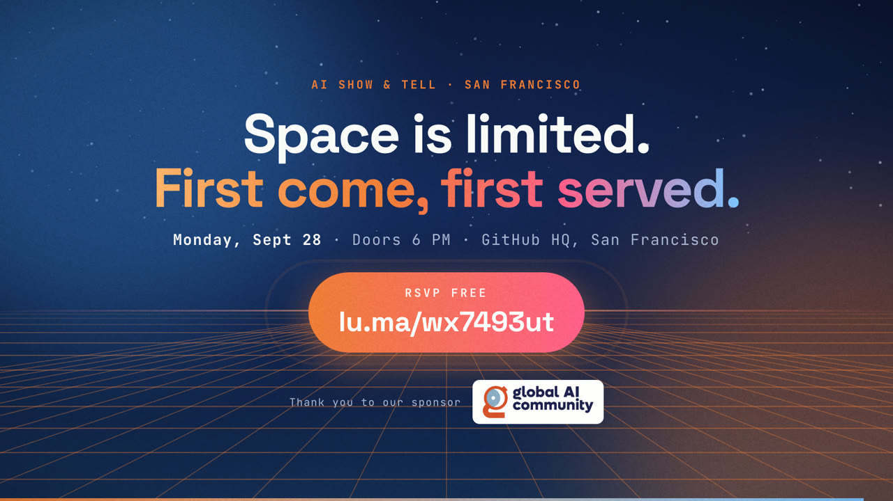
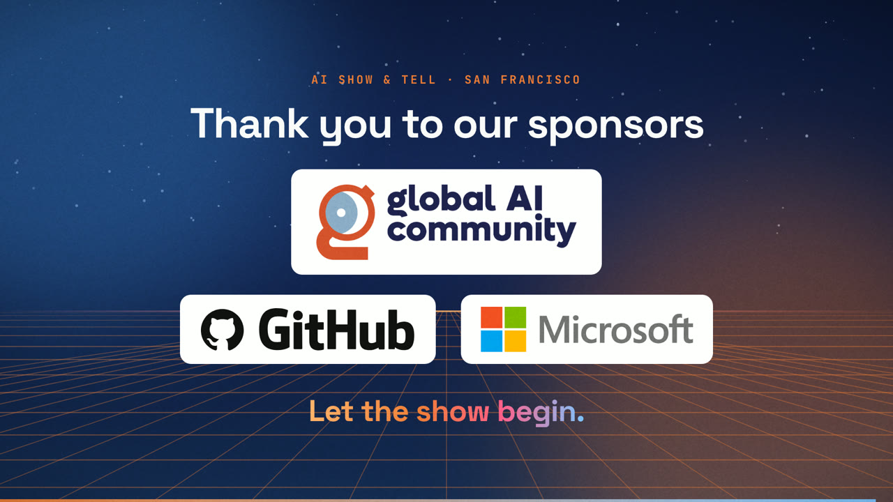
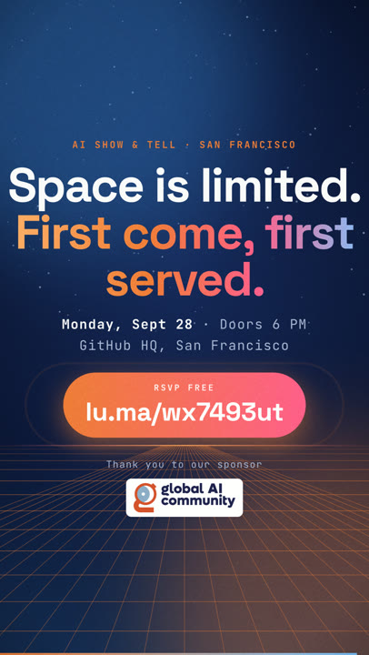

# AI Show & Tell: event promo video and stage opener

Animated promo videos and a live, click-through stage opener for community meetups, generated from a single `event.json`.

We built this with GitHub Copilot for the [AI Show & Tell](https://lu.ma/wx7493ut) meetup at GitHub HQ, San Francisco, on Sept 28, 2026 ("Agents on a Leash. Products on Trial."). This repo holds everything you need to reproduce it or make one for your own event. [PROMPTS.md](PROMPTS.md) has the exact prompts we used.

https://github.com/user-attachments/assets/83a3bdd9-4d1d-4278-a57b-6b65b6cdec25

*The social promo (16:9, sound on).*

| Social promo (16:9) | On-stage opener (16:9) | Social promo (9:16) |
|---|---|---|
|  |  |  |

▶️ **Watch all the videos in full quality and try the live stage opener:** download them from the [v1.0 release](https://github.com/cedricvidal/aist-event-video-and-stage-opener/releases/tag/v1.0).

## What you get

- **Social promo videos** in 16:9, 1:1 and 9:16, plus an opt-in 4:5 (1080×1350) for the LinkedIn and Instagram feeds. They feature the speakers, headshots, talk titles, a one-line hook per talk, and a motif animation for each speaker.
- **On-stage opener**: a 16:9 variant that introduces the hosts, then the speakers, then ends on a sponsor wall with a QR code.
- **Live stage opener (presenter HTML)**: a single offline HTML file (fonts, images, GSAP and audio all inlined). Press Space or use a presentation clicker to step through beats while the music keeps playing without a break. It comes in dark, light and adjustable-contrast versions for tricky projectors.
- **Original music**: `music/synth.py` synthesizes a 120 BPM synthwave bed in Python and lines every hit up with the animation cues. No licensed audio.

## How it works

Scenes are built with HTML/CSS + [GSAP](https://gsap.com). Playwright seeks the paused timeline frame by frame and pipes each frame into ffmpeg, so every render is deterministic and pixel-identical.

```
render.mjs          # render driver (static server + Playwright + ffmpeg)
live.mjs            # builds the offline, keyboard-driven on-stage presenter HTML
src/                # index.html, style.css, timeline.js (scenes built from event.json), live.js (presenter)
music/synth.py      # original 120 BPM synthwave bed + SFX (uv inline-script deps)
fonts/              # Space Grotesk + JetBrains Mono (OFL)
<video-folder>/     # one folder per video
  event.json        # event, speakers, hooks, timing/cues (single source of truth)
  assets/           # headshots, cover art, sponsor logos
  post-copy.md      # LinkedIn / X copy
  out/              # renders (gitignored)
```

The three example folders:

| Folder | What it is |
|---|---|
| `step-1-promo/` | The social promo: speakers, talks, and an RSVP call to action |
| `step-2-host/` | The same promo with a host and panel moderator scene |
| `step-3-stage/` | The on-stage opener: hosts, then speakers, then the sponsor wall with a QR code, and no RSVP |

## Quick start

Requirements: Node 20+, [ffmpeg](https://ffmpeg.org), [uv](https://docs.astral.sh/uv/).

```bash
git clone https://github.com/cedricvidal/aist-event-video-and-stage-opener
cd aist-event-video-and-stage-opener
npm ci
npx playwright install chromium   # first time only

# fast preview of one format (music is synthesized on first run)
node render.mjs step-1-promo --formats 1x1 --preview

# all three formats + posters, full quality
node render.mjs step-1-promo

# opt-in 4:5 feed format (reuses the 1:1 layout, tuned via html[data-aspect="4x5"])
node render.mjs step-1-promo --formats 4x5

# still frames at given times (seconds) for review
node render.mjs step-1-promo --stills 2.8,6.3,15,44

# regenerate the music only
uv run --script music/synth.py step-1-promo

# the on-stage opener + its live presenter HTML
node render.mjs step-3-stage --formats 16x9
node live.mjs step-3-stage --adjust
```

To preview in a browser, serve the repo root (for example `npx http-server .`), then open
`/src/index.html?event=step-1-promo&format=16x9&play`.

Outputs are written to `<video-folder>/out/`:

- `<slug>-16x9.mp4`, `<slug>-1x1.mp4`, `<slug>-9x16.mp4` (and `<slug>-4x5.mp4` when requested): H.264 High, yuv420p, 30 fps, AAC 192k, `+faststart`, audio at −14 LUFS
- `<slug>-<format>-poster.png`: thumbnail frames

Rendering is CPU-bound: expect about 8 minutes per format on a laptop, so about 30 minutes for all three. `--preview` only lowers the encode quality.

## Live presenter mode (on stage)

```bash
node live.mjs step-3-stage          # add --fresh after changing timing/cues
node live.mjs step-3-stage --theme light   # light-mode variant → <slug>-live-light.html
node live.mjs step-3-stage --adjust        # live contrast/brightness keys → <slug>-live-contrast.html
```

This builds `<video-folder>/out/<slug>-live.html`, a single offline file with fonts, images, GSAP and audio all inlined. Open it in Chrome, Edge or Safari. The first key press starts the show, and every later press plays the next beat, which then holds until the next key.

- **Beats:** the cold open (every scene up to and including the drop) plays as one beat, then each later scene is its own beat.
- **Music:** it never stops. The cold open plays the video's own intro, then a gapless 8-bar groove loop (`music/synth.py --live`) takes over. Each beat starts on a music beat and plays its own SFX slot. The final beat plays the riser into the final hit, and the loop fades out on `end_hit`.
- **Keys:**
  - Space, →, PageDown or Enter (presentation clickers work): next beat
  - ←, PageUp: previous beat
  - F: fullscreen
  - M: fade the music on or off
  - `+` and `−`: volume
  - B or `.`: black screen
  - Home: back to the start
  - `?`: help
  - With `--adjust` only: `]` and `[` change contrast, `'` and `;` change brightness, `0` resets. The setting is remembered across reloads.
- **Display:** the stage renders at a fixed 1920×1080 and is letterboxed to any window.
- **Audio levels:** the stems are loudness-matched to the rendered videos.

## Making your own, with prompts

You don't have to edit the files by hand. Clone this repo, open it in an agent (GitHub Copilot CLI, or VS Code in agent mode), and describe the event. These prompts are generalized from the ones we actually used (see [PROMPTS.md](PROMPTS.md)). Replace the `<…>` parts.

### 1. A promo video from a Luma event

```text
Create a promo video for my event <https://lu.ma/your-event>, using step-1-promo/ as the starting point in a new folder.
Read the Luma page for the title, date, venue, RSVP link, speakers and their talks, and download the
speaker headshots and the cover image into assets/. If a photo or talk description is missing, ask me.
Feature each speaker with their profile picture, a quick pitch about their talk, and a motif animation
that fits it, but feel free to be creative. It should be fantastic.
I'll publish it on LinkedIn, X and Instagram: render 16:9, 1:1, 9:16 and 4:5, and write the post copy.
```

Then iterate. These follow-ups made the biggest difference for us:

```text
For <speaker>'s talk you were lacking context. Look at <repo path or URL> and improve just that scene.
```

```text
Create an alternative version (keep the current one) with <https://www.linkedin.com/in/host> as the host and panel moderator.
```

### 2. A stage opener for the start of the event

```text
I need a variation of the 16:9 video to show on stage at the beginning of the event. Keep the previous
versions; this is a new one and only needs 16:9. Remove the RSVP and "space is limited" beats.
Present the hosts first (<Host A>, <Host B>), then the speakers, and end with the sponsors:
<Main sponsor> first, then <Venue sponsor> and <Other sponsor>. On the sponsor beat, add a QR code to <https://sponsor.example>.
Make a plan first.
```

Review the plan, say `go`, then turn it into a live, click-through opener:

```text
In addition to the video, make it a static file I can open in a browser, where Space and the right and left
arrows move between beats. The music has to stay on, uninterrupted, for the whole duration.
It must work offline, and I need a way to adjust the contrast for the projector.
```

That produces the single-file presenter described in [Live presenter mode](#live-presenter-mode-on-stage). Rehearse once on the venue laptop and projector.

### Tips

- **Give it context.** Point the agent at the speakers' projects or talk abstracts; generic pitches make generic scenes.
- **Ask for a plan before big changes**, then say `go`.
- **Keep variants additive.** Ask it to keep previous versions, so earlier videos keep rendering exactly the same.
- **Ask it to verify.** Stills, loudness, offline checks and decoding the QR code all catch issues before the event.
- The 9:16 layout keeps text between roughly 13% and 81% of the frame height, so platform UI overlays don't cover it.

<details>
<summary>Editing <code>event.json</code> by hand</summary>

1. Copy an existing video folder, for example `step-1-promo/`.
2. Edit `event.json`:
   - speakers, talk titles, hooks, and motif data (`log`, `frontier`, `vms`, `counters`, `scope`, `panel`)
   - optional `host` block (same fields as a speaker, plus `label`): it adds a host scene with id `host`, placed before `cta` in `timing.scenes`. See `step-2-host/`, which also reuses the base video's assets via `../` paths.
   - optional `hosts` list (`name`, `role`, `company`, `photo`, `label`): a joint "Your hosts" scene with id `hosts`. Optional `sponsors` (`title`, `logos` with the first shown biggest, `outro`, and an optional `qr` with `image` and `caption` shown next to the first logo): a sponsor-wall ending with id `sponsors`, used instead of `cta`. Leave out `rsvp_url` to drop RSVP from the footer, and set `brand_next` to change the "Meet the speakers →" teaser. See `step-3-stage/` (16:9 on-stage opener: `--formats 16x9`).
   - `timing.scenes` and `timing.cues`. Optional cues: `gap` (Scope product-gap stamp), `host_gavel` (panel badge slam), `sponsor_hits` (one hit per sponsor logo), and `groove_extra` (`[[start, end], …]` windows where drums and arp keep playing)
3. Drop the new headshots, cover, and logo into `assets/`.
4. Delete `out/music.wav` so the music is re-synthesized on the new cues, then render.

</details>

## Built with GitHub Copilot

The whole project, from the video and the music to the stage variant and the live presenter, was built in one GitHub Copilot session over 17 prompts. [PROMPTS.md](PROMPTS.md) lists them in order, with what each one produced. Use it as a recipe: point Copilot at your event page and speaker list, then iterate the same way.

## License

- **Code** (everything except what's listed below): [MIT](LICENSE)
- **Fonts**: SIL Open Font License 1.1 ([Space Grotesk](fonts/OFL-SpaceGrotesk.txt), [JetBrains Mono](fonts/OFL-JetBrainsMono.txt))
- **GSAP** is installed from npm under its own [standard license](https://gsap.com/standard-license) and is inlined into the live HTML.
- **Example assets** (speaker headshots, cover art, and the Microsoft, GitHub and Global AI Community logos) are **not** covered by the MIT license. They are included only so the examples render. See [ASSETS.md](ASSETS.md), and replace them with your own for your event.
